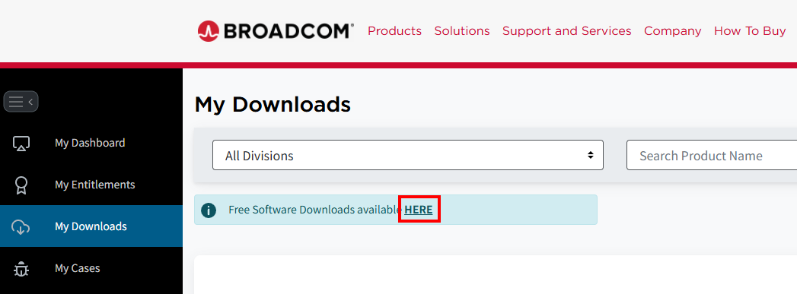

# iot-socket-programming-2026
IoT 개발자과정 TCP/IP 소켓 프로그래밍 학습 리포지토리

## 1일차

### VMware 설치

- VMware
    - Windows 환경에서 별도의 운영체제(OS)를 실행할 수 있도록 해주는 가상 머신 프로그램
    - 하나의 PC에서 여러 운영체제를 동시에 사용할 수 있음

- 설치방법
    - https://www.vmware.com/products/desktop-hypervisor/workstation-and-fusion
    - DOWNLOAD NOW 클릭 후 로그인
    - My Downloads > HERE 클릭

        

    - VMware Workstation Pro > VMware Workstation Pro 25H2 for Windows > 25H2
    - 


### Ubuntu 설치


## 4일차

## 5일차

### 임계영역

- 둘 이상의 스레드가 동시에 접근하여 실행하면 문제를 일으키는 영역
- 동기화처리 기법
    - 뮤텍스(Mutex)기반 동기화
    - 세마포어(Semaphore)기반 동기화

#### 멀티스레드 동기화

- MUTEX 생성과 소멸
```C
    #include <pthread.h>

    int pthread_mutex_init (pthread_mutex_t* mutex, const pthread_mutexattr_t* attr) // 생성
    int pthread_mutex_destory () // 소멸
```

- 멀티스레드 - [참고](thread03.c)
```C
    #include <pthread.h>

    int pthread_create (pthread_t* restict)
```

- 아직 타입을 정하지 않았을 때 보통 **void***을 사용

## 6일차

- 운영체제와 대화를 주고받는 방법 - [참고](main.c)
